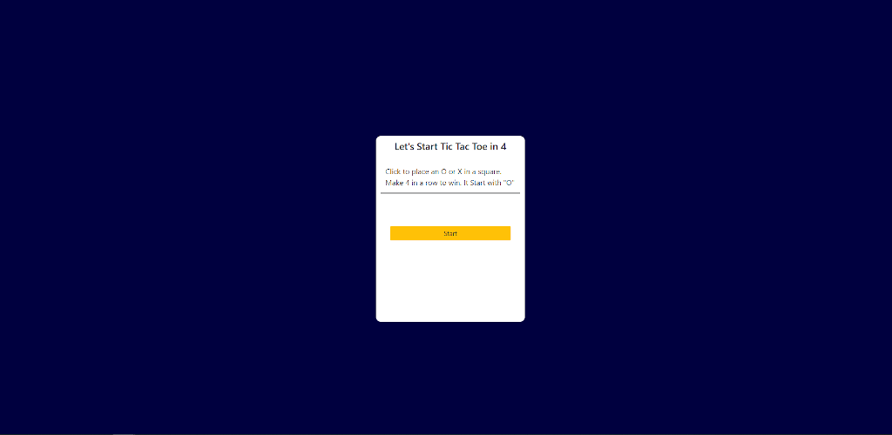
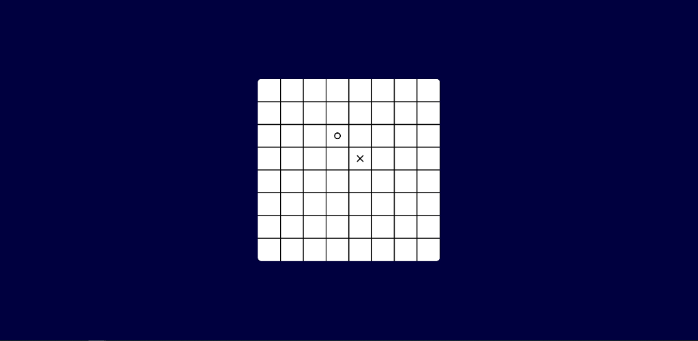
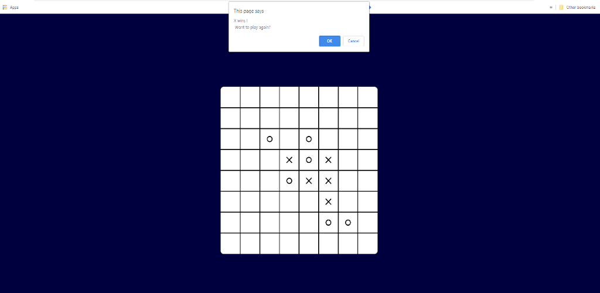

# This is a html 5 game, its the same Tic-Tac-Toe

This is a board game built in Javascript. The logic of this game is similar to Tic-Tac-Toe, but it required 4 in a row to win the game.

# Introduction
Click to place an O or X in a square.  It Start with "O". The player who succeeds in placing four of their marks in a horizontal, vertical, or diagonal row is the winner.

## Built With

* [p5](https://p5js.org/) - The JavaScript library
